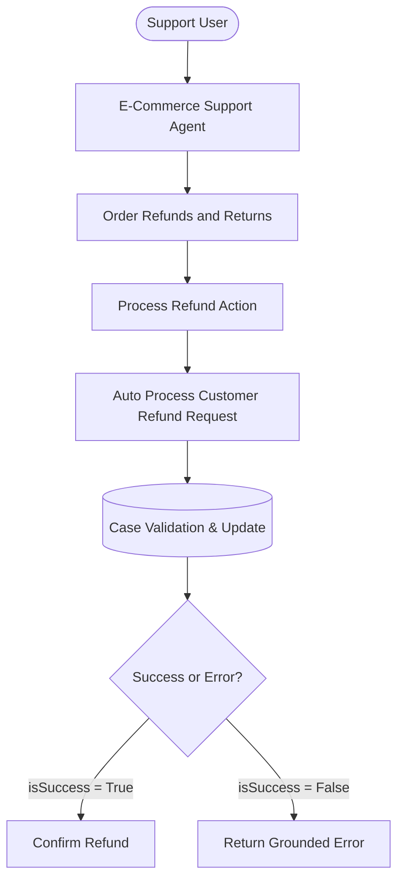
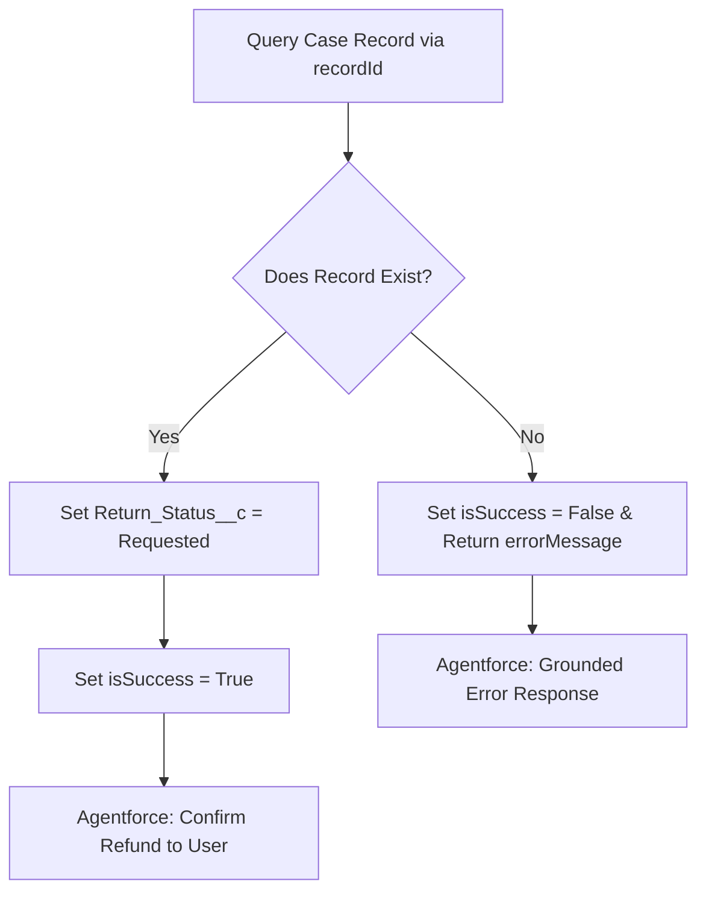
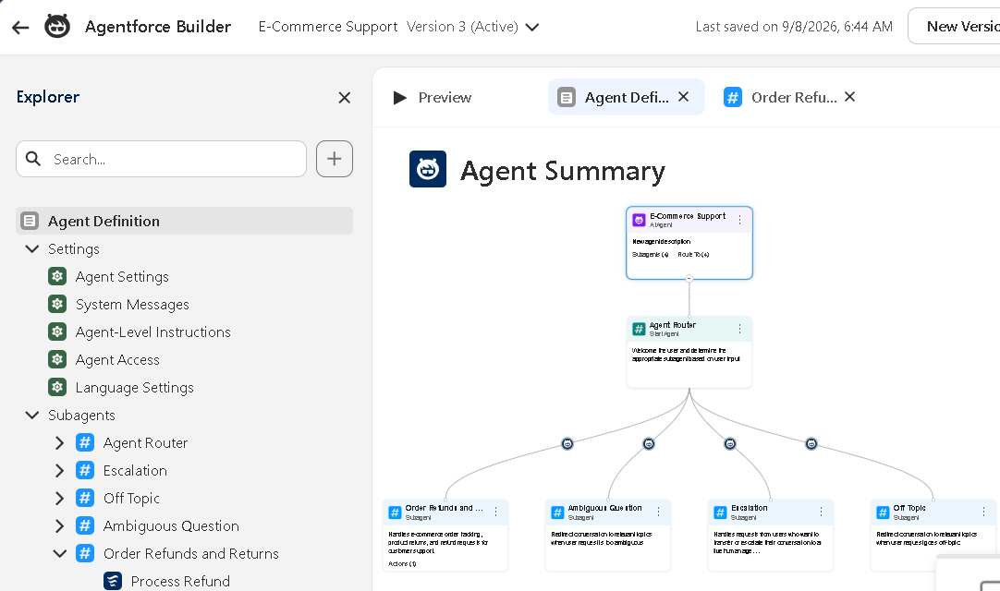
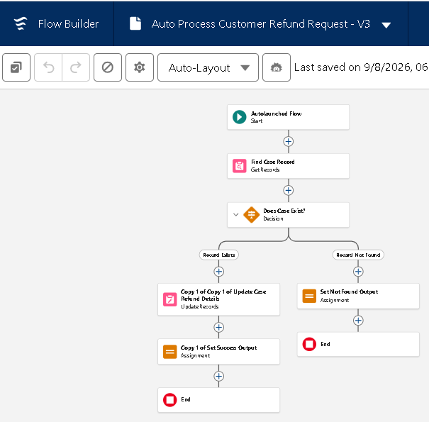
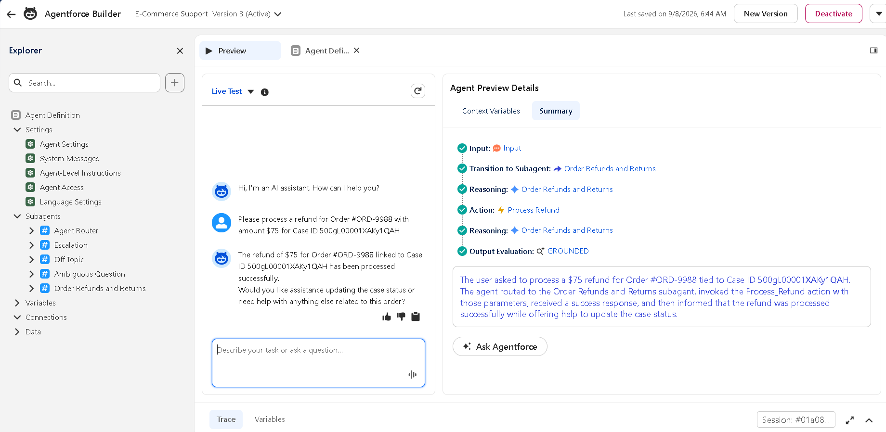
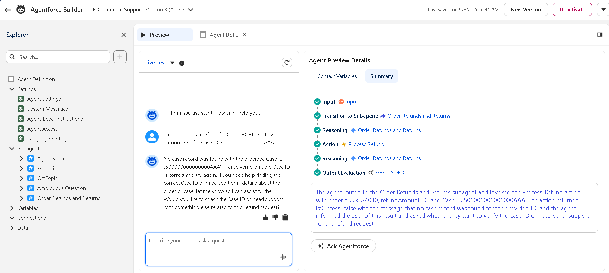
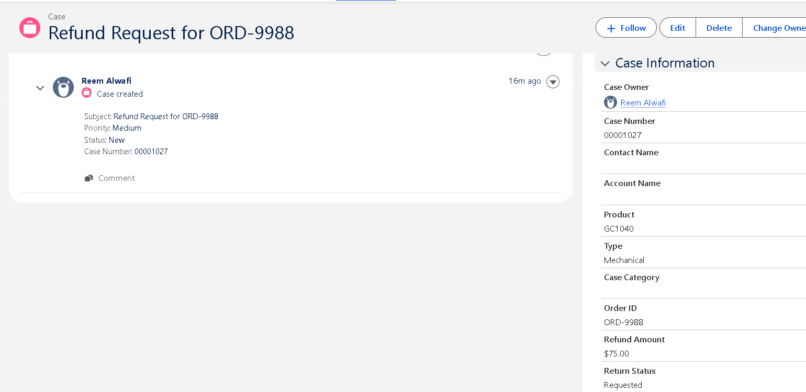

# E-Commerce Support Automation

An AI-powered customer support automation system built on Salesforce Service Cloud, combining **Agentforce** with **Salesforce Flow** to automate e-commerce refund requests with grounded error handling.

---

## Overview

The system enables support teams to handle refund operations through an Agentforce AI agent.

The agent analyzes user requests, collects the required information, invokes backend automation through Salesforce Flow, and responds based on the actual execution result.

> **Key Principle:** The AI does not assume a refund succeeded. The backend Flow explicitly returns `isSuccess` and `errorMessage` to eliminate conversational hallucinations.

---

## Architecture

---

## Key Features

* **Agentforce AI Agent:** Handles support requests and routes refund-related tasks dynamically.
* **Refund & Returns Subagent:** Dedicated subagent specialized in order returns and reimbursements.
* **Flow Automation:** Validates Case records and deterministically updates refund attributes.
* **Agent Action Integration:** Bridges conversational natural language parameters directly to the backend Flow.
* **Grounded Error Handling:** Relies strictly on `isSuccess` and `errorMessage` variables to prevent false positive confirmations.
* **Dual Interface:** Supports conversational execution via Agentforce and manual case-level operations via a Screen Flow.

---

## Salesforce Components

| Component | Type | Purpose |
| :--- | :--- | :--- |
| **`E_Commerce_Support`** | Agentforce Agent | Top-level agent handling conversational orchestration and routing |
| **`Order Refunds and Returns`** | Subagent | Domain-specific subagent dedicated to refund and return operations |
| **`Process Refund`** | Agent Action | Action connecting conversational intent to backend Flow execution |
| **`Auto Process Customer Refund Request`** | Autolaunched Flow | Backend automation engine running queries, validations, and updates |
| **`Process Customer Refund Request`** | Screen Flow | Interactive UI embedded on the Case record page for direct processing |
| **`Case_Record_Page`** | Lightning Page | Enhanced Case record interface with contextual variable integration |

---

## Case Fields

* **`Order_ID__c`** *(Text)*: Stores the purchase order identifier.
* **`Refund_Amount__c`** *(Currency)*: The monetary reimbursement value.
* **`Return_Status__c`** *(Picklist)*: Tracks the status lifecycle (`Requested`, etc.).

---

## Error Handling

If the Case cannot be found, the backend Flow returns `isSuccess = False` alongside a granular `errorMessage`. The Agentforce agent grounds its response on this result rather than falsely assuming the refund succeeded.

---

## Screenshots

  <b>Agentforce Architecture</b> 
  

---

  <b>Refund Backend Flow</b> 
  

---

  <b>Successful Refund Execution</b> 
  

---

  <b>Failed Refund (Grounded Error Handling)</b> 
  

---

  <b>Salesforce Case Interface</b> 
  

---

## Tech Stack

* **Salesforce Service Cloud**
* **Agentforce & Agentforce Builder**
* **Salesforce Flow (Autolaunched & Screen Flow)**
* **Salesforce DX (SFDX)**
* **Git & GitHub**

---

## Scope

* Built in a Salesforce Developer Edition environment using demo data.
* No real customer data, live payment gateways, or banking integrations are used.

